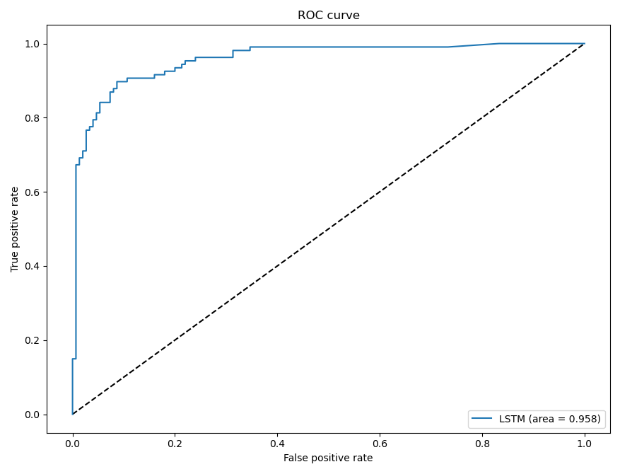

# Smart-Contract-Gambling-Detection

Using a CNN-biLSTM classification model, we are able to classify with ~90% ± 5% accuracy if a contract is related to gambling. We compiled a list of 223 gambling/non-gambling contracts and used etherscan.io api to pull their transaction history (latest 1000 transactions split into 10 examples of 100 triplets). The three specific features we look for per transaction are value, internal value, and token transfer value. We used the CNN layer to merge those three values and a 2 layer bidirectional LSTM to summarize the time features before passing it through a single dense layer set to a sigmoid activation to make a prediction.

